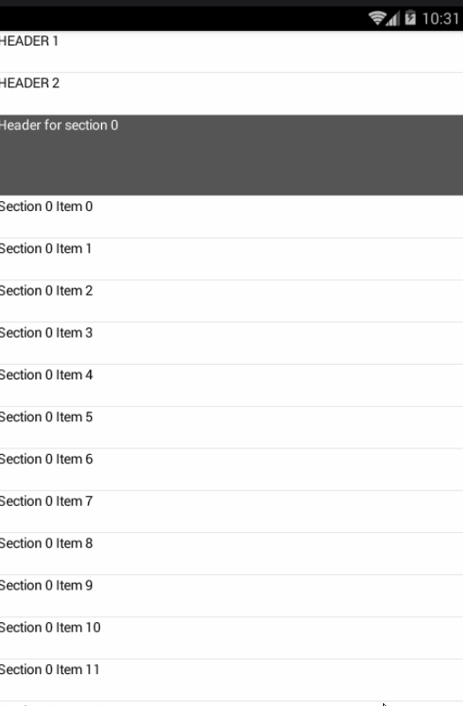

#悬浮条目
效果图gif



##步骤一:

```
/**
  * 实现组的头部总是悬浮在顶部的listview tuill包中的PinnedHeaderListView
  */

  public class PinnedHeaderListView extends ListView implements OnScrollListener {

      private OnScrollListener mOnScrollListener;

      public static interface PinnedSectionedHeaderAdapter {

          //是否是组的头部
          public boolean isSectionHeader(int position);

          //根据位置判断对应的组号
          public int getSectionForPosition(int position);

          //组的头部View
          public View getSectionHeaderView(int section, View convertView, ViewGroup parent);

          //视图类型
          public int getSectionHeaderViewType(int section);

          //条目
          public int getCount();

      }

      private PinnedSectionedHeaderAdapter mAdapter;
      private View mCurrentHeader;
      private int mCurrentHeaderViewType = 0;
      private float mHeaderOffset;
      private boolean mShouldPin = true;
      private int mCurrentSection = 0;
      private int mWidthMode;
      private int mHeightMode;

      public PinnedHeaderListView(Context context) {
          super(context);
          super.setOnScrollListener(this);
      }

      public PinnedHeaderListView(Context context, AttributeSet attrs) {
          super(context, attrs);
          super.setOnScrollListener(this);
      }

      public PinnedHeaderListView(Context context, AttributeSet attrs, int defStyle) {
          super(context, attrs, defStyle);
          super.setOnScrollListener(this);
      }

      public void setPinHeaders(boolean shouldPin) {
          mShouldPin = shouldPin;
      }

      @Override
      public void setAdapter(ListAdapter adapter) {
          mCurrentHeader = null;
          mAdapter = (PinnedSectionedHeaderAdapter) adapter;
          super.setAdapter(adapter);
      }

      @Override
      public void onScroll(AbsListView view, int firstVisibleItem, int visibleItemCount, int totalItemCount) {
          if (mOnScrollListener != null) {
              mOnScrollListener.onScroll(view, firstVisibleItem, visibleItemCount, totalItemCount);
          }

          //得到Header的个数
          if (mAdapter == null || mAdapter.getCount() == 0 || !mShouldPin || (firstVisibleItem < getHeaderViewsCount())) {
              mCurrentHeader = null;
              mHeaderOffset = 0.0f;
              for (int i = firstVisibleItem; i < firstVisibleItem + visibleItemCount; i++) {
                  View header = getChildAt(i);
                  if (header != null) {
                      header.setVisibility(VISIBLE);
                  }
              }
              return;
          }

          //去掉Hearder View的影响
          firstVisibleItem -= getHeaderViewsCount();

          //得到组号
          int section = mAdapter.getSectionForPosition(firstVisibleItem);
          int viewType = mAdapter.getSectionHeaderViewType(section);
          mCurrentHeader = getSectionHeaderView(section, mCurrentHeaderViewType != viewType ? null : mCurrentHeader);

          //layout header,使它在最顶端
          ensurePinnedHeaderLayout(mCurrentHeader);
          mCurrentHeaderViewType = viewType;

          mHeaderOffset = 0.0f;

          for (int i = firstVisibleItem; i < firstVisibleItem + visibleItemCount; i++) {
              if (mAdapter.isSectionHeader(i)) {
                  View header = getChildAt(i - firstVisibleItem);
                  float headerTop = header.getTop();
                  float pinnedHeaderHeight = mCurrentHeader.getMeasuredHeight();
                  header.setVisibility(VISIBLE);

                  // 下一个组的头部快滑动到顶部，
                  // 距离顶部的距离小于现在在顶部悬浮的head的高度了
                  if (pinnedHeaderHeight >= headerTop && headerTop > 0) {

                      //MheaderOffset是小于0的
                      mHeaderOffset = headerTop - header.getHeight();

                  } else if (headerTop <= 0) {

                      //下一个组的头部滑动到了顶部了
                      header.setVisibility(INVISIBLE);
                  }
              }
          }

          invalidate();
      }

      @Override
      public void onScrollStateChanged(AbsListView view, int scrollState) {
          if (mOnScrollListener != null) {
              mOnScrollListener.onScrollStateChanged(view, scrollState);
          }
      }

      private View getSectionHeaderView(int section, View oldView) {
          boolean shouldLayout = section != mCurrentSection || oldView == null;

          View view = mAdapter.getSectionHeaderView(section, oldView, this);
          if (shouldLayout) {
              // a new section, thus a new header. We should lay it out again
              ensurePinnedHeaderLayout(view);
              mCurrentSection = section;
          }
          return view;
      }

      /**
       * layout header,使它在最顶端
       * @param header 组对应的头部view
       */
      private void ensurePinnedHeaderLayout(View header) {
          if (header.isLayoutRequested()) {
              int widthSpec = MeasureSpec.makeMeasureSpec(getMeasuredWidth(), mWidthMode);

              int heightSpec;
              ViewGroup.LayoutParams layoutParams = header.getLayoutParams();
              if (layoutParams != null && layoutParams.height > 0) {
                  heightSpec = MeasureSpec.makeMeasureSpec(layoutParams.height, MeasureSpec.EXACTLY);
              } else {
                  heightSpec = MeasureSpec.makeMeasureSpec(0, MeasureSpec.UNSPECIFIED);
              }
              header.measure(widthSpec, heightSpec);
              header.layout(0, 0, header.getMeasuredWidth(), header.getMeasuredHeight());
          }
      }

      @Override
      protected void dispatchDraw(Canvas canvas) {
          super.dispatchDraw(canvas);
          if (mAdapter == null || !mShouldPin || mCurrentHeader == null)
              return;
          int saveCount = canvas.save();

          //沿y轴向下移动mHeaderOffset距离,把画布移动到(0,mHeaderOffset)
          //注意，此处mHeaderOffset是<=0的，所以等于说是把画布往上移动了一段距离
          canvas.translate(0, mHeaderOffset);
          canvas.clipRect(0, 0, getWidth(), mCurrentHeader.getMeasuredHeight()); // needed
          // for
          // <
          // HONEYCOMB
          mCurrentHeader.draw(canvas);
          canvas.restoreToCount(saveCount);
      }

      @Override
      public void setOnScrollListener(OnScrollListener l) {
          mOnScrollListener = l;
      }

      @Override
      protected void onMeasure(int widthMeasureSpec, int heightMeasureSpec) {
          super.onMeasure(widthMeasureSpec, heightMeasureSpec);

          mWidthMode = MeasureSpec.getMode(widthMeasureSpec);
          mHeightMode = MeasureSpec.getMode(heightMeasureSpec);
      }

      public void setOnItemClickListener(OnItemClickListener listener) {
          super.setOnItemClickListener(listener);
      }

      public static abstract class OnItemClickListener implements AdapterView.OnItemClickListener {

         /*
         *onSectionItemClick： 组的item被点击的点击回调
          onSectionClick： 组的头部被点击的点击回调
          onHeaderClick： list view的头部view被点击的点击回调
          onFooterClick： list view的footer被点击的点击回调
         */
          @Override
          public void onItemClick(AdapterView<?> adapterView, View view, int rawPosition, long id) {
              SectionedBaseAdapter adapter;
              if (adapterView.getAdapter().getClass().equals(HeaderViewListAdapter.class)) {
                  HeaderViewListAdapter wrapperAdapter = (HeaderViewListAdapter) adapterView.getAdapter();
                  adapter = (SectionedBaseAdapter) wrapperAdapter.getWrappedAdapter();
              } else {
                  adapter = (SectionedBaseAdapter) adapterView.getAdapter();
              }
              int section = adapter.getSectionForPosition(rawPosition);
              int position = adapter.getPositionInSectionForPosition(rawPosition);

              if (position == -1) {
                  onSectionClick(adapterView, view, section, id);
              } else {
                  onItemClick(adapterView, view, section, position, id);
              }
          }

          public abstract void onItemClick(AdapterView<?> adapterView, View view, int section, int position, long id);

          public abstract void onSectionClick(AdapterView<?> adapterView, View view, int section, long id);

      }
```


##步骤二:

```
/**
 *封装的adapter的抽象类
 tuill包中的SectionedBaseAdapter
 */

public abstract class SectionedBaseAdapter extends BaseAdapter implements PinnedHeaderListView.PinnedSectionedHeaderAdapter {

    private static int HEADER_VIEW_TYPE = 0;
    private static int ITEM_VIEW_TYPE = 0;


    /**
     * Holds the calculated values of @{link getPositionInSectionForPosition}
     */
    private SparseArray<Integer> mSectionPositionCache;
    /**
     * Holds the calculated values of @{link getSectionForPosition}
     */
    private SparseArray<Integer> mSectionCache;
    /**
     * Holds the calculated values of @{link getCountForSection}
     */
    private SparseArray<Integer> mSectionCountCache;

    /**
     * Caches the item count
     */
    private int mCount;
    /**
     * Caches the section count
     */
    private int mSectionCount;

    public SectionedBaseAdapter() {
        super();
        mSectionCache = new SparseArray<Integer>();
        mSectionPositionCache = new SparseArray<Integer>();
        mSectionCountCache = new SparseArray<Integer>();
        mCount = -1;
        mSectionCount = -1;
    }

    @Override
    public void notifyDataSetChanged() {
        mSectionCache.clear();
        mSectionPositionCache.clear();
        mSectionCountCache.clear();
        mCount = -1;
        mSectionCount = -1;
        super.notifyDataSetChanged();
    }

    @Override
    public void notifyDataSetInvalidated() {
        mSectionCache.clear();
        mSectionPositionCache.clear();
        mSectionCountCache.clear();
        mCount = -1;
        mSectionCount = -1;
        super.notifyDataSetInvalidated();
    }

    @Override
    public final int getCount() {

        //item的条数
        if (mCount >= 0) {
            return mCount;
        }

        int count = 0;
        for (int i = 0; i < internalGetSectionCount(); i++) {

            //添加组内元素的个数
            count += internalGetCountForSection(i);

            //添加组头部
            count++; // for the header view

        }
        mCount = count;
        return count;
    }

    @Override
    public final Object getItem(int position) {
        return getItem(getSectionForPosition(position), getPositionInSectionForPosition(position));
    }

    @Override
    public final long getItemId(int position) {
        return getItemId(getSectionForPosition(position), getPositionInSectionForPosition(position));
    }
    /*
    * 根据position是不是sectionHeader,来判断是调用返回getSectionHeaderView，
    * 还是调用返回getItemView
    */
    @Override
    public final View getView(int position, View convertView, ViewGroup parent) {
        if (isSectionHeader(position)) {
            return getSectionHeaderView(getSectionForPosition(position), convertView, parent);
        }

        //返回组内元素对应的View
        return getItemView(getSectionForPosition(position), getPositionInSectionForPosition(position), convertView, parent);
    }

    @Override
    public final int getItemViewType(int position) {
        if (isSectionHeader(position)) {
            return getItemViewTypeCount() + getSectionHeaderViewType(getSectionForPosition(position));
        }
        return getItemViewType(getSectionForPosition(position), getPositionInSectionForPosition(position));
    }

    @Override
    public final int getViewTypeCount() {
        return getItemViewTypeCount() + getSectionHeaderViewTypeCount();
    }

    /*
    * 根据位置得到对应的组号
    */
    public final int getSectionForPosition(int position) {

        // first try to retrieve values from cache
        Integer cachedSection = mSectionCache.get(position);
        if (cachedSection != null) {
            return cachedSection;
        }
        int sectionStart = 0;
        for (int i = 0; i < internalGetSectionCount(); i++) {
            int sectionCount = internalGetCountForSection(i);
            int sectionEnd = sectionStart + sectionCount + 1;
            if (position >= sectionStart && position < sectionEnd) {
                mSectionCache.put(position, i);
                return i;
            }
            sectionStart = sectionEnd;
        }
        return 0;
    }

    /*
    * 得到在组中的位置
    */
    public int getPositionInSectionForPosition(int position) {
        // first try to retrieve values from cache
        Integer cachedPosition = mSectionPositionCache.get(position);
        if (cachedPosition != null) {
            return cachedPosition;
        }
        int sectionStart = 0;
        for (int i = 0; i < internalGetSectionCount(); i++) {
            int sectionCount = internalGetCountForSection(i);
            int sectionEnd = sectionStart + sectionCount + 1;
            if (position >= sectionStart && position < sectionEnd) {
                int positionInSection = position - sectionStart - 1;
                mSectionPositionCache.put(position, positionInSection);
                return positionInSection;
            }
            sectionStart = sectionEnd;
        }
        return 0;
    }
 }

    /*
    * 是否是组的头部
    */
    public final boolean isSectionHeader(int position) {
        int sectionStart = 0;
        for (int i = 0; i < internalGetSectionCount(); i++) {
            if (position == sectionStart) {
                return true;
            } else if (position < sectionStart) {
                return false;
            }
            sectionStart += internalGetCountForSection(i) + 1;
        }
        return false;
    }

    public int getItemViewType(int section, int position) {
        return ITEM_VIEW_TYPE;
    }

    public int getItemViewTypeCount() {
        return 1;
    }

    public int getSectionHeaderViewType(int section) {
        return HEADER_VIEW_TYPE;
    }

    public int getSectionHeaderViewTypeCount() {
        return 1;
    }

    public abstract Object getItem(int section, int position);

    public abstract long getItemId(int section, int position);

    //组的个数
    public abstract int getSectionCount();

    //某个组内元素的个数
    public abstract int getCountForSection(int section);

    //得到组元素得到的View
    public abstract View getItemView(int section, int position, View convertView, ViewGroup parent);

    //组的头部View
    public abstract View getSectionHeaderView(int section, View convertView, ViewGroup parent);

    private int internalGetCountForSection(int section) {
        Integer cachedSectionCount = mSectionCountCache.get(section);
        if (cachedSectionCount != null) {
            return cachedSectionCount;
        }
        int sectionCount = getCountForSection(section);
        mSectionCountCache.put(section, sectionCount);
        return sectionCount;
    }

    private int internalGetSectionCount() {
        if (mSectionCount >= 0) {
            return mSectionCount;
        }
        mSectionCount = getSectionCount();
        return mSectionCount;
    }

}
```
##步骤三:

```

/**
 *实现了抽象类SectionedBaseAdapter的adapter
 */

public class TestSectionedAdapter extends SectionedBaseAdapter {

    @Override
    public Object getItem(int section, int position) {
        // TODO Auto-generated method stub
        return null;
    }

    @Override
    public long getItemId(int section, int position) {
        // TODO Auto-generated method stub
        return 0;
    }

    //悬浮数
    @Override
    public int getSectionCount() {
        return 7;
    }

    //条目数
    @Override
    public int getCountForSection(int section) {
        return 15;
    }

    @Override
    public View getItemView(int section, int position, View convertView, ViewGroup parent) {
        LinearLayout layout = null;
        if (convertView == null) {
            LayoutInflater inflator = (LayoutInflater) parent.getContext().getSystemService(Context.LAYOUT_INFLATER_SERVICE);
            layout = (LinearLayout) inflator.inflate(R.layout.list_item, null);
        } else {
            layout = (LinearLayout) convertView;
        }
        ((TextView) layout.findViewById(R.id.textItem)).setText("Section " + section + " Item " + position);
        return layout;
    }

    @Override
    public View getSectionHeaderView(int section, View convertView, ViewGroup parent) {
        LinearLayout layout = null;
        if (convertView == null) {
            LayoutInflater inflator = (LayoutInflater) parent.getContext().getSystemService(Context.LAYOUT_INFLATER_SERVICE);
            layout = (LinearLayout) inflator.inflate(R.layout.header_item, null);
        } else {
            layout = (LinearLayout) convertView;
        }
        ((TextView) layout.findViewById(R.id.textItem)).setText("Header for section " + section);
        return layout;
    }

}
```
##步骤四:

```
/*
* 具体使用的activity
*/

public class MainActivity extends AppCompatActivity {

    @Override
    protected void onCreate(Bundle savedInstanceState) {
        super.onCreate(savedInstanceState);
        setContentView(R.layout.activity_main);

        PinnedHeaderListView listView = (PinnedHeaderListView) findViewById(R.id.pinnedListView);
        LayoutInflater inflator = (LayoutInflater) getSystemService(Context.LAYOUT_INFLATER_SERVICE);
        LinearLayout header1 = (LinearLayout) inflator.inflate(R.layout.list_item, null);
        ((TextView) header1.findViewById(R.id.textItem)).setText("HEADER 1");
        LinearLayout header2 = (LinearLayout) inflator.inflate(R.layout.list_item, null);
        ((TextView) header2.findViewById(R.id.textItem)).setText("HEADER 2");
        LinearLayout footer = (LinearLayout) inflator.inflate(R.layout.list_item, null);
        ((TextView) footer.findViewById(R.id.textItem)).setText("FOOTER");
        listView.addHeaderView(header1);
        listView.addHeaderView(header2);
        listView.addFooterView(footer);
        TestSectionedAdapter sectionedAdapter = new TestSectionedAdapter();
        listView.setAdapter(sectionedAdapter);
    }
    @Override
    public boolean onCreateOptionsMenu(Menu menu) {
        getMenuInflater().inflate(R.menu.activity_main, menu);
        return true;
    }
}
```

